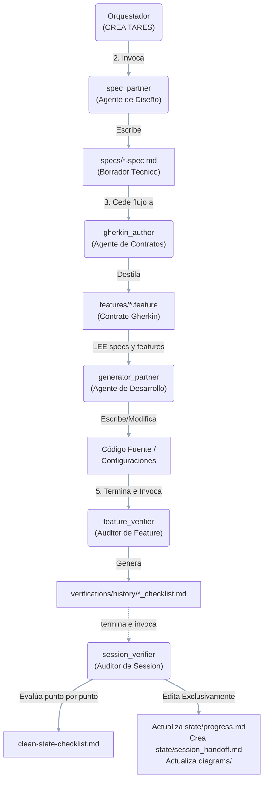

# Diagrama de Flujo de Trabajo (El Flujo Conecta 4)

Este documento contiene la representación visual del ciclo de vida de una tarea dentro del Meta-Arnés. Ilustra los roles de los distintos agentes, las intervenciones humanas y los archivos que sirven como puntos de control a lo largo del proceso.

